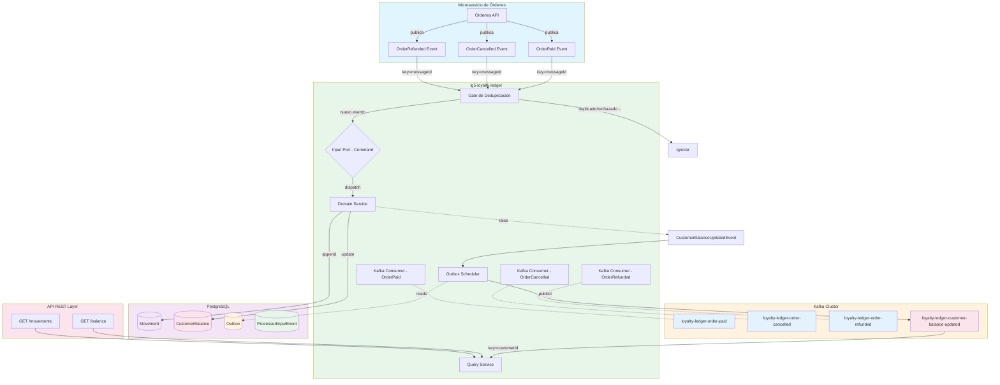
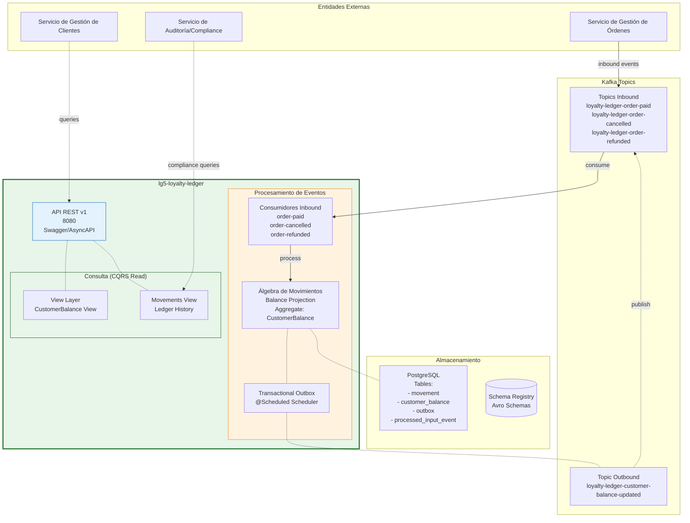
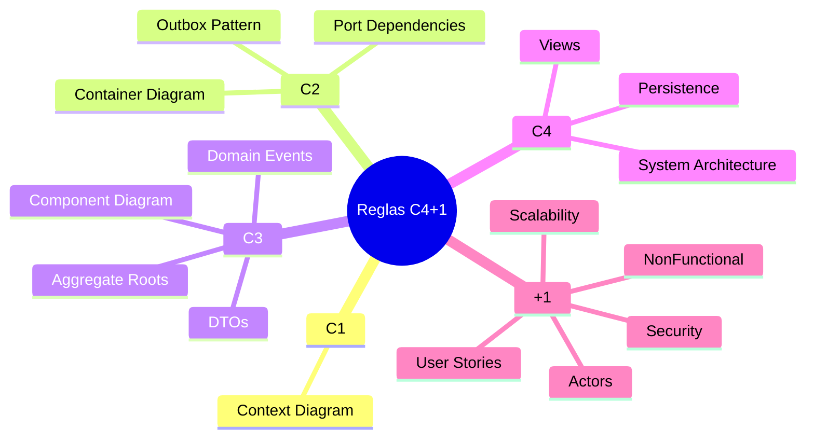

# Arquitectura de lg5-loyalty-ledger

Este documento describe la arquitectura del servicio `lg5-loyalty-ledger`, incluyendo:

1. **Arquitectura de eventos** - Diagrama de flujo de eventos con Kafka
2. **Modelo C4+1** - Arquitectura desde contexto hasta detalles técnicos

---

## 1. Arquitectura de Eventos



---

## 2. Modelo C4+1

### 2.1 C1 - Context Diagram (Vista de Contorno)

```mermaid
graph LR
    subgraph External ["Sistemas Externos"]
        OrderSvc[Microservicio de Órdenes
                 <br/>lg-orders]
        CustomerSvc[Microservicio de Clientes
                    <br/>lg-customers]
        OrderSvc2[Microservicio de Órdenes
                   <br/>lg-orders]
    end

    subgraph LG5Loyalty ["lg5-loyalty-ledger"]
        direction TB
        API[API REST<br/>8080]
        KafkaIn[Kafka Inbound<br/>Consumer]
        KafkaOut[Kafka Outbound<br/>Outbox]
    end

    subgraph Storage ["Almacenamiento"]
        DB[(PostgreSQL<br/>H2 en dev)]
        Kafka[(Kafka Cluster<br/>3 brokers)]
    end

    %% Event flows
    OrderSvc -->|Order Paid/Cancelled/Refunded| KafkaIn
    OrderSvc2 -->|Order Paid/Cancelled/Refunded| KafkaIn
    
    %% API flows
    CustomerSvc -->|queries| API
    OrderSvc -->|audit queries| API

    %% Outbox flow
    KafkaOut -->|CustomerBalanceUpdated| Kafka

    %% Storage
    API -.reads-> DB
    KafkaOut -.reads-> DB
    
    %% Styling
    style LG5Loyalty fill:#e8f5e9,stroke:#2e7d32,stroke-width:2px
```

### 2.2 C2 - Container Diagram (Vista de Contenedor)

```mermaid
graph TB
    subgraph Containments ["Contenedores Spring Boot"]
        API[lg5-loyalty-ledger-api<br/>Spring WebFlux<br/>Port: 8080]
        APP[lg5-loyalty-ledger-application<br/>Application Services<br/>Inbound Consumers]
        OUTBOX[Outbox Scheduler<br/>Spring @Scheduled<br/>Thread-safe]
    end

    subgraph Infrastructure ["Infraestructura"]
        DIR[Directory Services<br/>Client Discovery]
        DB[(PostgreSQL<br/>JPA Hibernate<br/>@Version)]
        KAFKA_IN[Kafka Consumer<br/>order-paid/cancelled/refunded<br/>GroupId: lg5-loyalty-...]<br/>
        KAFKA_OUT[Kafka Producer<br/>Topic: customer-balance-updated<br/>Key: customerId]
    end

    %% Dependencies
    API --> APP
    API -.read-> DB
    
    APP -->|inbound| KAFKA_IN
    APP -->|domain logic| APP
    APP -->|append| DB
    APP -->|outbox queue| DB
    
    OUTBOX -.reads-> DB
    OUTBOX -.reads-> APP
    OUTBOX -.- KAFKA_OUT
    OUTBOX -.read-> DB
    
    %% Styling
    style API fill:#e3f2fd,stroke:#1565c0
    style APP fill:#e8f5e9,stroke:#2e7d32
    style OUTBOX fill:#fff3e0,stroke:#ef6c00
    style DB fill:#f3e5f5,stroke:#7b1fa2
    style KAFKA_IN fill:#fff9c4,stroke:#f9a825
    style KAFKA_OUT fill:#e3f2fd,stroke:#1565c0
```

### 2.3 C3 - Component Diagram (Vista de Componentes - Core)

```mermaid
classDiagram
    class Movement {
        -CustomerId customerId
        -int delta
        -BalanceUpdateCause cause
        -OrderId originatingOrderId
        -UUID originatingEventId
        -String originatingEventType
        -ZonedDateTime originatingEventReceivedAt
        -ZonedDateTime appendedAt
        -int version
        +CustomerId getCustomerId()
        +int getDelta()
        +BalanceUpdateCause getCause()
        +OrderId getOriginatingOrderId()
        +appendOnly()
    }

    class CustomerBalance {
        -long balance
        -ZonedDateTime lastUpdatedAt
        -int version
        +CustomerBalance(CustomerId, long, ZonedDateTime, int)
        +applyDelta(int)
        +getBalance()
        +getLastUpdatedAt()
    }

    class ProcessedInputEvent {
        -ProcessedInputEventId processedInputEventId
        -ProcessedInputEventOutcome processedInputEventOutcome
        -int delta
        -boolean deduplicated
        -String deduplicatedReason
        +ProcessedInputEvent(ProcessedInputEventId, ProcessedInputEventOutcome, int, boolean, String)
        +getProcessedInputEventId()
        +getProcessedInputEventOutcome()
        +getDelta()
        +isDeduplicated()
        +getDeduplicatedReason()
    }

    class OrderPaidAvroModel {
        -String id
        -String customerId
        -String orderId
        -BigInteger paidAmount
        -Long createdAt
    }

    class OrderCancelledAvroModel {
        -String id
        -String customerId
        -String orderId
        -Long createdAt
    }

    class OrderRefundedAvroModel {
        -String id
        -String customerId
        -String orderId
        -Long createdAt
    }

    class CustomerBalanceUpdatedAvroModel {
        -String messageId
        -String customerId
        -long newBalance
        -int delta
        -BalanceUpdateCause cause
        -OrderId originatingOrderId
        -UUID originatingEventId
        -String originatingEventType
        -Long occurredAt
    }

    class LoyaltyLedgerInputPort {
        +applyCredit(CustomerId eventId, long delta)
        +applyDebit(CustomerId eventId, long delta, String reason)
    }

    class LoyaltyLedgerQueryService {
        +getBalance(CustomerId)
        +getMovements(CustomerId, Pagination)
    }

    class CommandBus {
        +handle(Any)
    }

    class QueryBus {
        +handle(Any)
    }

    Movement --> CustomerBalance
    Movement --* ProcessedInputEvent
    OrderPaidAvroModel <|-- OrderCancelledAvroModel
    OrderPaidAvroModel <|-- OrderRefundedAvroModel
    OrderPaidAvroModel <|-- CustomerBalanceUpdatedAvroModel
    
    class CustomerBalanceUpdatedEvent {
        +CustomerId customerId
        +long newBalance
        -int delta
        +BalanceUpdateCause cause
        +OrderId originatingOrderId
        +UUID originatingEventId
        +String originatingEventType
        +ZonedDateTime occurredAt
    }

    class CustomerBalanceUpdatedOutboxScheduler {
        +schedule()
        +relay(Payload)
    }

    class CustomerBalanceUpdatedEventPayload {
        +CustomerId customerId
        +long newBalance
        -int delta
        +BalanceUpdateCause cause
        +OrderId originatingOrderId
        +UUID originatingEventId
        +String originatingEventType
        +ZonedDateTime occurredAt
    }

    CustomerBalanceUpdatedAvroModel *-- CustomerBalanceUpdatedEventPayload
    CustomerBalanceUpdatedEventPayload --* CustomerBalanceUpdatedEvent : serializa

    LoyaltyLedgerInputPort -|-- CommandBus
    CommandBus -.- Movement
    CommandBus -.- CustomerBalance
    LoyaltyLedgerQueryService -|-- QueryBus
    QueryBus -.- CustomerBalance
```

### 2.4 C4 - System Architecture (Vista de Arquitectura)



### 2.5 Reglas de Calidad (Quality Rules)



---

## Resumen de Patrones

| Patrón | Descripción | Ubicación |
|--------|-------------|-----------|
| **CQRS** | Separación escritura/lectura | Application Layer |
| **Outbox** | Publicación transaccional de eventos | Outbox Scheduler + DB |
| **Event Sourcing** | Ledger inmutable como history | Movement aggregate |
| **Aggregate Root** | CustomerBalance, Movement | Domain Core |
| **Deduplication** | Gate `(messageId, eventType)` | Consumer side |
| **Transactional Outbox** | Publicación garantizada | Outbox table + scheduler |
| **AsyncAPI** | Contrato de eventos | docs/api/asyncapi.yaml |

---

## Referencias

- **Framework:** [`lg5-spring`](https://github.com/lg-labs-pentagon/lg5-spring)
- **Ejemplo real:** [`food-ordering-system`](https://github.com/lg-labs/food-ordering-system)
- **Avro Schema Registry:** [`lg5-loyalty-ledger-message`](./lg5-loyalty-ledger-message/)
- **AsyncAPI Spec:** [`docs/api/asyncapi.yaml`](./docs/api/asyncapi.yaml)
- **OpenAPI Spec:** [`docs/api/openapi.yaml`](./docs/api/openapi.yaml)

---

*Generado para `lg5-loyalty-ledger` siguiendo el workflow Spec-Driven Development.*