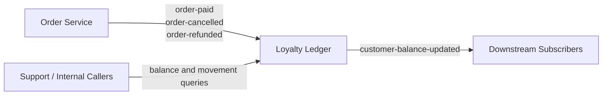
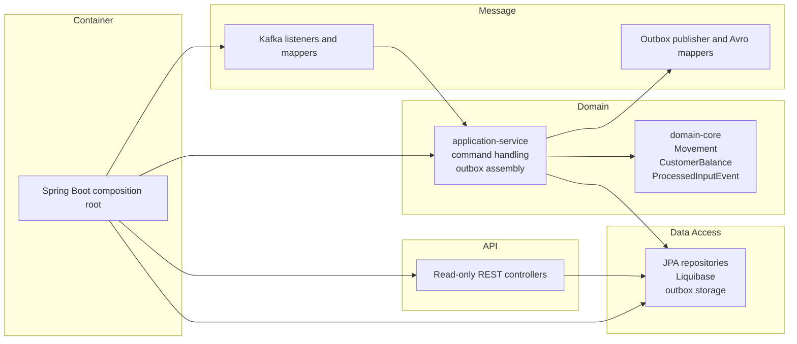
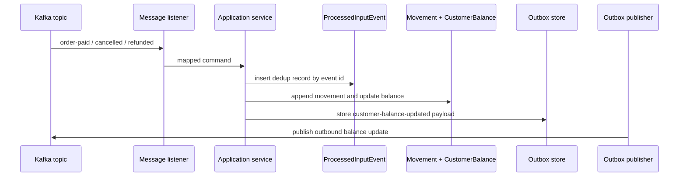
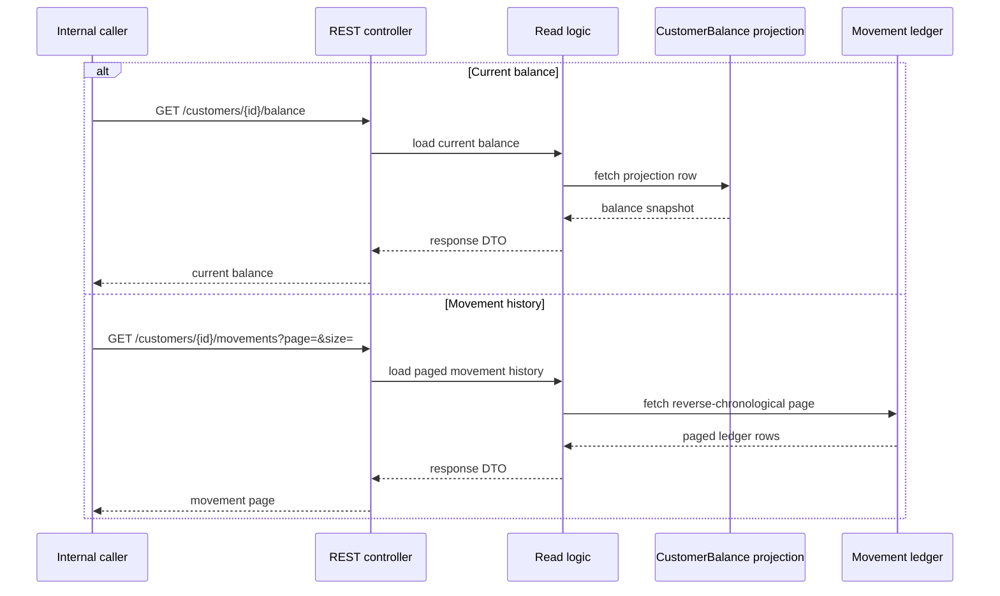

# C4+1 Views

This page complements the [Architecture overview](./index.md) with a small set
of practical views that make the service easier to reason about. The goal is
not to mirror every class or deployment detail, but to show the boundaries,
collaborators, and main flows that matter when you work on `loyalty-ledger`.

## System context

At system level, `loyalty-ledger` is the bounded context that translates order
lifecycle events into an auditable loyalty ledger and publishes balance updates
for downstream consumers.

The key architectural point in this view is ownership: `order-service` owns the
upstream order facts, while `loyalty-ledger` owns the loyalty movement history,
the current balance projection, and the downstream balance-change signal.

## Container and module view

Inside the repository, the service follows the usual lg5 split between domain,
application, transport, persistence, and composition-root concerns.

The domain modules express business meaning, while the outer modules adapt that
meaning to HTTP, Kafka, persistence, and runtime wiring. That separation is the
main reason the service remains explainable despite handling event ingestion,
deduplication, projections, and outbound publication at the same time.

## Dynamic view: write path

The write path starts with an inbound order event and ends with a committed
movement, an updated balance projection, and a staged outbound message.

This is the most important flow in the system. It combines four architectural
choices that show up repeatedly across the code and specs: event-id-based
deduplication, immutable ledger append, materialized balance projection, and
outbox-backed publication.

## Dynamic view: read path

The read path is deliberately simpler: callers do not rebuild the balance by
replaying events; they read a projection for the current balance and query the
append-only ledger for movement history.

This split is why the service can serve fast balance reads without giving up the
append-only ledger as the auditable history behind the projection.

## How to use these views

- Start with the [Architecture overview](./index.md) if you need the narrative
  first.
- Continue to [DDD](./ddd.md) if you want to understand module boundaries and
  business concepts.
- Use [REST](./rest.md) and [Events](./events.md) when you need contract-level
  interpretation of the service interfaces.
